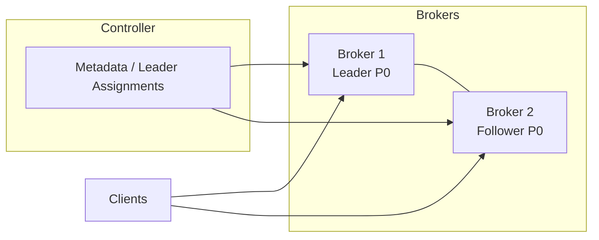

# Cluster Design (Draft)

## Goals
- Multiple brokers with unique `BrokerID`.
- Partition replication with leader/follower roles, ISR tracking, and leader epochs.
- Separate controller to own metadata, topic assignments, and leader elections (future: Raft).
- Reuse/extend existing binary protocol for broker–broker metadata/replication RPCs.

## Entities
- **ClusterMetadata**: ClusterID, Brokers (BrokerID, host/port, rack), Partitions (assignments, ISR, leader, leaderEpoch, replication factor), version/epoch.
- **Broker**: runs storage, broker core, frontends; exposes binary protocol; participates in replication as leader or follower per partition replica.
- **Topic/Partition/Replica**: Partitions have replicas across brokers; each replica has `PartitionRole` (Leader/Follower), `LeaderEpoch`, high watermark.

## Metadata Model
- BrokerInfo: `{BrokerID, Host, Port, Rack}`.
- PartitionAssignment: `{Topic, Partition, Replicas []BrokerID, ISR []BrokerID, Leader BrokerID, LeaderEpoch int32}`.
- ClusterMetadata: `{ClusterID, Version/Epoch, Brokers, Partitions}`.
- Controller is the source of truth; brokers cache metadata and watch for updates.

## Components & Packages
- `internal/controller`: controller core, metadata store, broker registration, topic assignment; single-node controller returns static metadata now; future: Raft-backed metadata.
- `internal/replication`: broker–broker fetch/replicate; follower fetches from leader using (a subset of) binary protocol; track HWMark/leader epoch.
- Reuse binary protocol for:
  - broker–client (already),
  - broker–broker replication (future fetch),
  - broker–controller metadata sync (future).

### Static cluster bootstrap (current step)
- Early multi-broker mode is defined by `api.StaticClusterConfig` (ClusterID + Brokers).
- ReplicationFactor is kept at 1; controller assigns partition leaders via a simple deterministic policy (e.g., round-robin) across the static broker list.
- No controller quorum/Raft yet; all brokers can share the same static config to derive identical `ClusterMetadata`.
- ISR membership is adjusted by the controller via follower progress reports (ReportReplicaProgress); follower joins ISR once it reaches the leader high watermark and is removed when it lags behind (temporary rule to be refined later).

## Client Routing
- Clients discover leader via Metadata response (extended with ClusterMetadata).
- Controller assigns leaders; brokers advertise `AdvertisedAddr`.
- Future: controller-driven leader election and ISR management.

## Diagram (mermaid)

