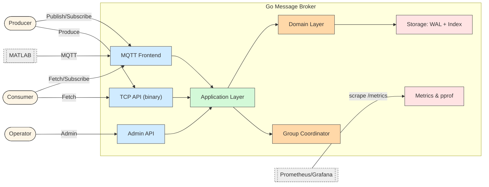

```mermaid
%%{init: {'theme':'default'}}%%
flowchart LR
  classDef person fill:#fdf5e6,stroke:#333;
  classDef ext fill:#eee,stroke:#555,stroke-dasharray:3 3;
  classDef adapter fill:#d0ebff,stroke:#4a4a4a;
  classDef app fill:#d3f9d8,stroke:#4a4a4a;
  classDef domain fill:#ffd8a8,stroke:#4a4a4a;
  classDef infra fill:#ffe3e3,stroke:#4a4a4a;

  Producer([Producer]):::person -->|Publish/Subscribe| MQTT
  Consumer([Consumer]):::person -->|Fetch/Subscribe| MQTT
  Producer -->|Produce| TCPAPI
  Consumer -->|Fetch| TCPAPI
  MATLAB[[MATLAB]]:::ext -->|MQTT| MQTT
  Operator([Operator]):::person -->|Admin| AdminAPI
  Obs[[Prometheus/Grafana]]:::ext -->|scrape /metrics| Metrics

  subgraph Broker["Go Message Broker"]
    MQTT[MQTT Frontend]:::adapter
    TCPAPI["TCP API (binary)"]:::adapter
    AdminAPI[Admin API]:::adapter
    App[Application Layer]:::app
    Domain[Domain Layer]:::domain
    Storage[Storage: WAL + Index]:::infra
    GroupCoord[Group Coordinator]:::domain
    Metrics[Metrics & pprof]:::infra

    MQTT --> App
    TCPAPI --> App
    AdminAPI --> App
    App --> Domain
    Domain --> Storage
    App --> GroupCoord
  end
```