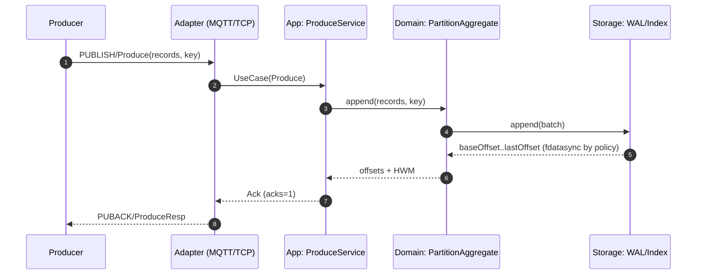

# Последовательность: Produce (acks=1)

%%{init: {'theme':'default'}}%%

```mermaid
sequenceDiagram
  autonumber
  participant P as Producer
  participant A as Adapter (MQTT/TCP)
  participant S as App: ProduceService
  participant D as Domain: PartitionAggregate
  participant W as Storage: WAL/Index

  P->>A: PUBLISH/Produce(records, key)
  A->>S: UseCase(Produce)
  S->>D: append(records, key)
  D->>W: append(batch)
  W-->>D: baseOffset..lastOffset (fdatasync by policy)
  D-->>S: offsets + HWM
  S-->>A: Ack (acks=1)
  A-->>P: PUBACK/ProduceResp
```