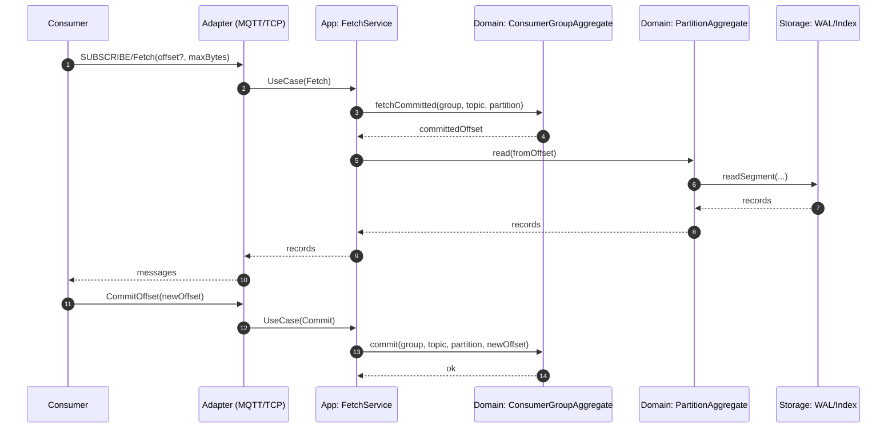

%%{init: {'theme':'default'}}%%

```mermaid
sequenceDiagram
  autonumber
  participant C as Consumer
  participant A as Adapter (MQTT/TCP)
  participant F as App: FetchService
  participant G as Domain: ConsumerGroupAggregate
  participant D as Domain: PartitionAggregate
  participant W as Storage: WAL/Index

  C->>A: SUBSCRIBE/Fetch(offset?, maxBytes)
  A->>F: UseCase(Fetch)
  F->>G: fetchCommitted(group, topic, partition)
  G-->>F: committedOffset
  F->>D: read(fromOffset)
  D->>W: readSegment(...)
  W-->>D: records
  D-->>F: records
  F-->>A: records
  A-->>C: messages

  C->>A: CommitOffset(newOffset)
  A->>F: UseCase(Commit)
  F->>G: commit(group, topic, partition, newOffset)
  G-->>F: ok
```