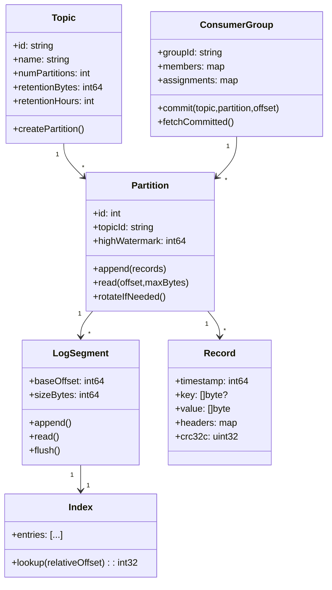

%%{init: {'theme':'default'}}%%

```mermaid
classDiagram
  class Topic {
    +id: string
    +name: string
    +numPartitions: int
    +retentionBytes: int64
    +retentionHours: int
    +createPartition()
  }
  class Partition {
    +id: int
    +topicId: string
    +highWatermark: int64
    +append(records)
    +read(offset,maxBytes)
    +rotateIfNeeded()
  }
  class LogSegment {
    +baseOffset: int64
    +sizeBytes: int64
    +append()
    +read()
    +flush()
  }
  class Index {
    +lookup(relativeOffset): int32
    +entries: [...]
  }
  class ConsumerGroup {
    +groupId: string
    +members: map
    +assignments: map
    +commit(topic,partition,offset)
    +fetchCommitted()
  }
  class Record {
    +timestamp: int64
    +key: []byte?
    +value: []byte
    +headers: map
    +crc32c: uint32
  }

  Topic "1" --> "*" Partition
  Partition "1" --> "*" LogSegment
  LogSegment "1" --> "1" Index
  ConsumerGroup "1" --> "*" Partition
  Partition "1" --> "*" Record
```